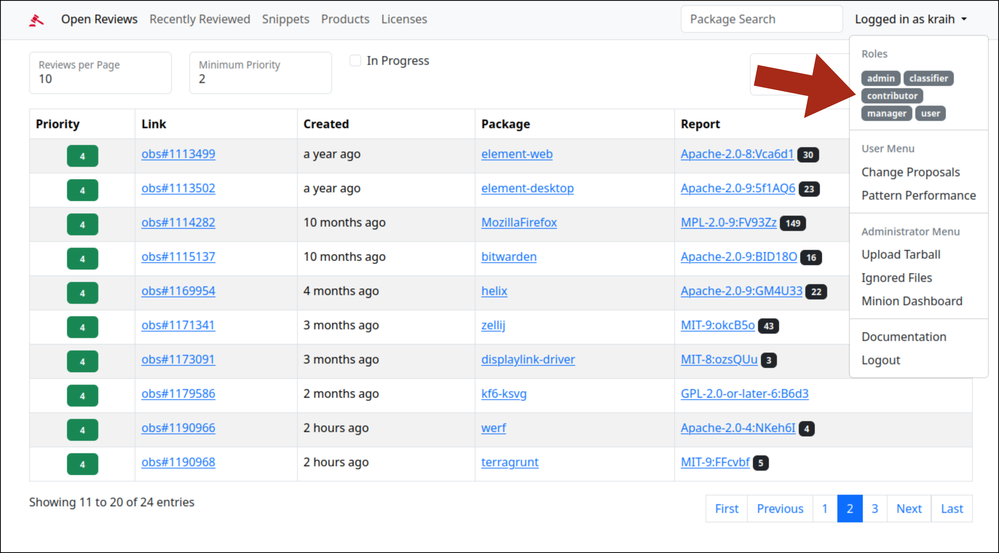
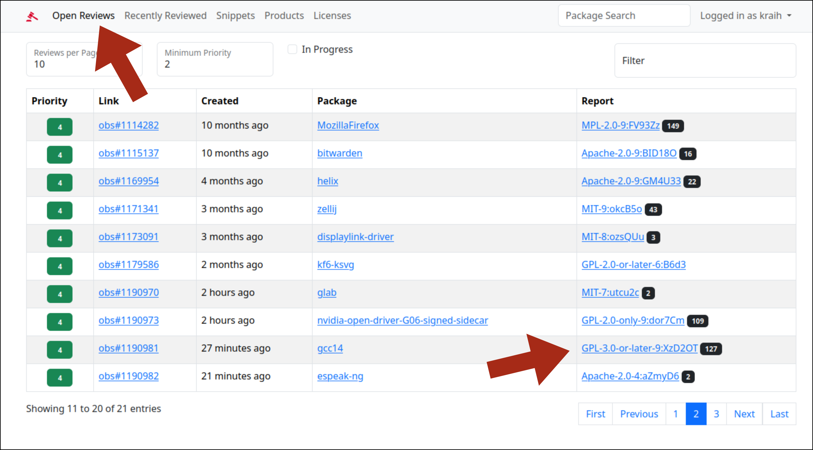
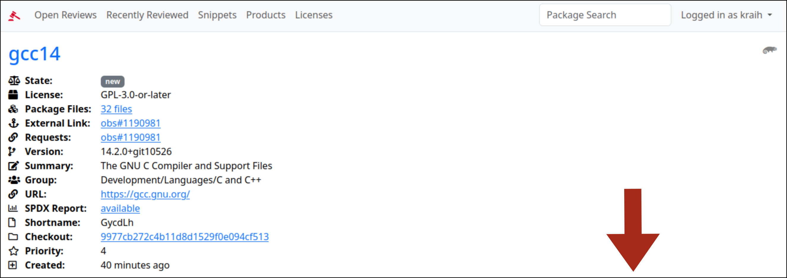
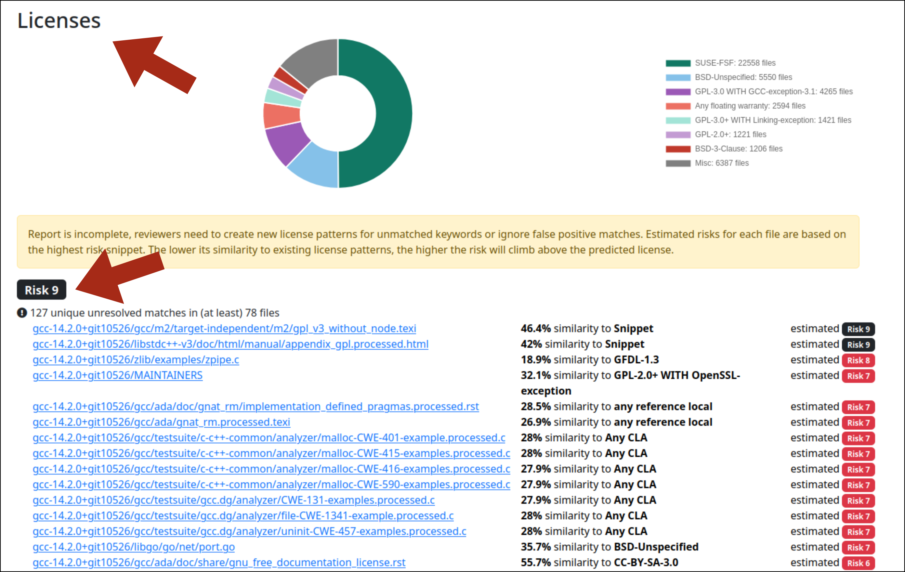
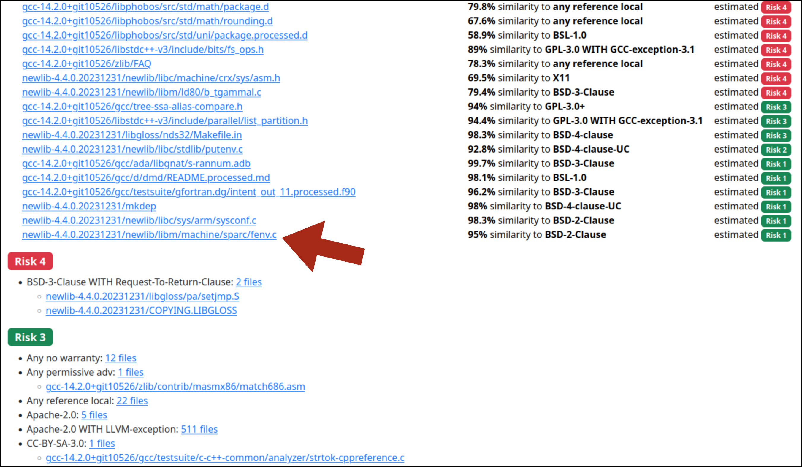
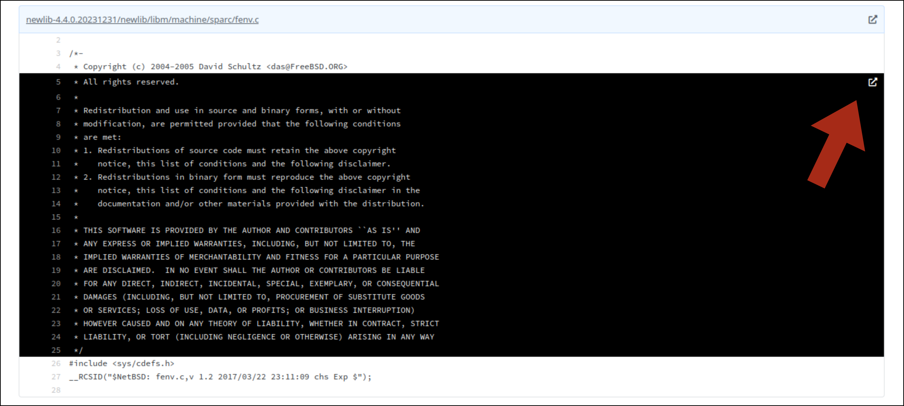
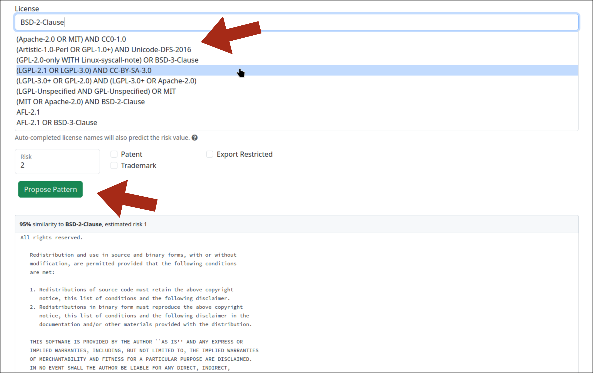
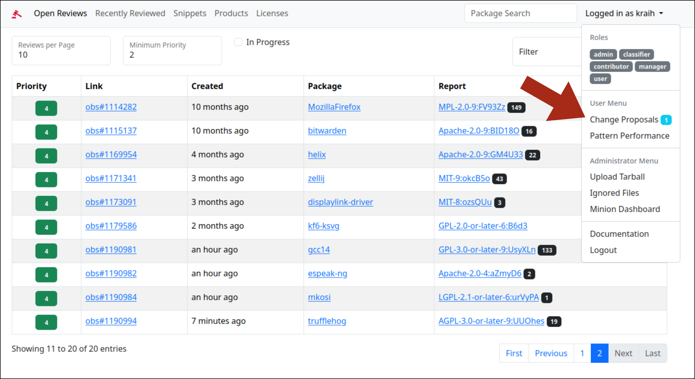
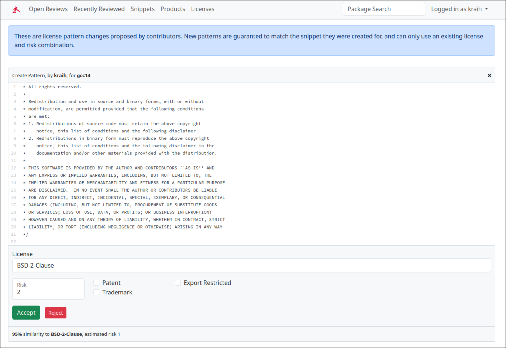
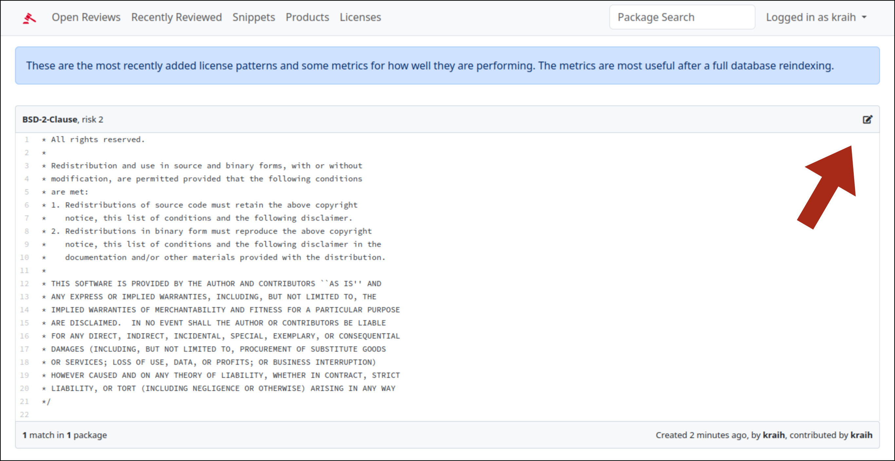

# Cavil Contributor Workflow

## Motivation

Cavil depoends on its list of known license patterns for creating reports. By default this is about 26.000 patterns for
2.000 unique license combinations. Open Source developers tend to be quite creative with license declarations however.
And that means with constant package updates we also require a constant stream of new license patterns, to be able to
genrate high quality reports that can be reviewed quickly. The creation of these new license patterns is the main
bottleneck in the whole review process.

While entirely new licenses require an in depth review by a lawyer, who can accurately assess its potential risk, new
patterns for already known licenses are much easier to add. But they do still require some manual work, and this is
where volunteers can help out as contributors.

## Contributor Workflow

This is the workflow contributors use to propose new license patterns.

### Contributor Role

Before you can get started, you need to make sure you have the right permissions. This can be checked by logging into
Cavil and looking at the assigned roles in the "Logged in as ..." menu. Here you should see the "contributor" role. If
you don't see the role you will have to contact the admin of your Cavil instance and ask for the role to be assigned to
you.

### Open Reviews

To get started use the "Open Reviews" link at the top to get to the current backlog of packages that still need to be
reviewed. In the "Report" column you can find links to the associated reports. Some reports will have a black badge
with a number attached. This badge represents the number of unresolved keyword matches and is the primary indicator for
reports that are of interest to contributors.

Once looking at the report you will see a lot of information that can be a little overwhelming at first. Most of it can
be safely ignored by contributors and is only relevant for legal reviewers. Just scroll down until you reach the
"License" section.

### Unresolved Matches

The "License" section contains a list of all known licenses and snippets of possible legal text that Cavil has found in
the package, ordered by risk. Since snippets of possible legal text (also known as unresolved matches) are always
considered risk 9 (the highest risk), they will be at the very top of the listing.

Under "Risk 9" you will find links to all files containing unresolved matches, together with a prediction of what Cavil
believes the license of the highest risk snippet in the file might be. Unfortunately these predictions are still often
incorrect, but will improve as the system learns from new data.

As you scroll down the list of files, the estimated risks will decrease and the similarity between the highest risk
snippet and known licenses will increase. For this reason creating new license patterns for snippets from the bottom of
the list is often easier than for those at the top.

Clicking on a file will get you to the file preview.

At the file preview you will see unresolved matches highlighted in black with some context around the snippets.
Sometimes there will be highlighted blocks of text in other colors too, those are matches for known license patterns
and require no actions to be taken. Once you have found a "black match" that you are confident you can assign a license
name to, just click on the little icon in its upper right corner to open the snippet editor in a new browser tab.

You will probably not be able to resolve all "black matches" yourself, and that's ok. Some will simply be false
positives that need to be ignored. Others might represent new licenses that require the attention of a lawyer. New
features might be added in the future to allow you to help with these as well.

### Propose Pattern

With the snippet editor you can make small adjustments to the soon to be license pattern. Remove sections of text that
are irrelevant and replace company names or dates with placeholders like `$SKIP7` (this one will skip up to `7` words).
Just make sure to include all red lines, because these are the ones that include keyword matches.

Finding the right balance between larger and smaller patterns is not an exact science and requires some experience. If
none of the red lines contain any actual legal text, or if all legal text appears outside the red lines, that would be
an indicator that this snippet should be ignored.

And don't worry about getting the pattern wrong. You will immediately see an error message if the submitted pattern
does not match the snippet it was created for.

If you scroll down a bit you will reach the license field, here you can select any of the 2.000+ license combinations
currently known to Cavil. Just start typing the name and multiple options will become available for auto-complete. Once
selected, the appropriate risk for the license will be assigned automatically.

You may select one or more of the available special flags as well, such as "Patent" if the text contains a patent
clause, "Trademark" if the text contains a trademark, or "Export Restricted" if the text contains any mentions of
export restrictions. This is rarely necessary however.

Once you are satisfied, just click on the "Propose Pattern" button and you are done.

And don't worry about getting the license name or risk wrong. You will immediately see an error message if the
submitted license and risk do not match a known combination.

Btw. Every time you deselect the snippet editor the license pattern comparison at the bottom of the page will update.
So you always know what the closest existing license pattern is to the one you are about to create.

And if you have second thoughts, just click on the "proposals" link to get to a page where you can delete the proposal
again with a click on the little "x" in the top right corner of your proposal.

## Admin Workflow

This is the workflow admins use to review proposed license patterns and decide if they should be added to the system.

### Proposed Changes

Every time there is a proposal waiting for approval you will see a blue badge in the "logged in as ..." menu. Just
click on "Change Proposals" to start reviewing them. Once approved you can check their performance by clicking on
"Pattern Performance".

Review the license pattern carefully. While the pattern itself is guaranteed to match the snippet it was created for,
and the license name and risk are required to come from an existing combination, it is still easy for contributors to
get the license wrong.

In such cases it is up to you to decide if you want to fix the license, or reject the proposal. Approved proposals will
result in immediate reindexing of the relevant packages.

### Pattern Performance

Here we measure the performance of the most recently added license patterns. The number of matching files and packages
will usually be fairly low in the beginning, since the pattern has only been applied to a small number of packages. For
best results it is recommended to do the performance review after a full database rebuild (which usually happens during
the weekend). License patterns that don't live up to expectations can be edited or deleted by clicking on the little
edit icon in the top right corner.

We hope you have a great experience with this workflow. And don't hesitate to let us know if you have any ideas for how
to improve it.
